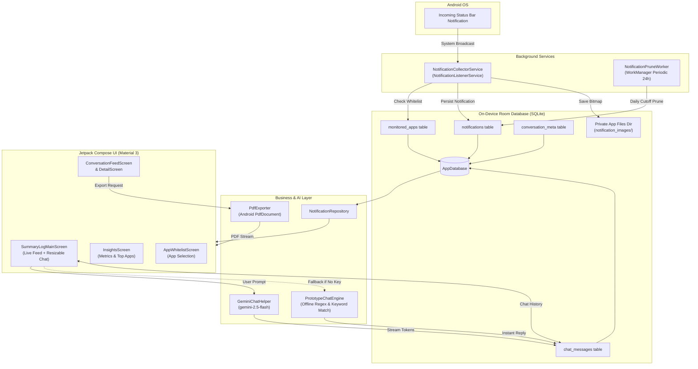
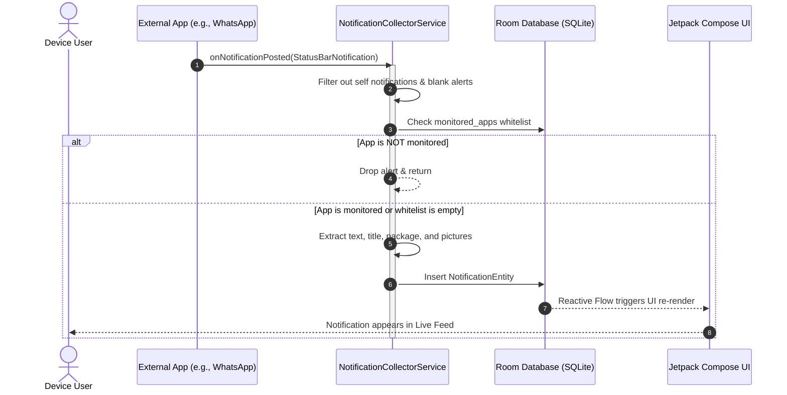
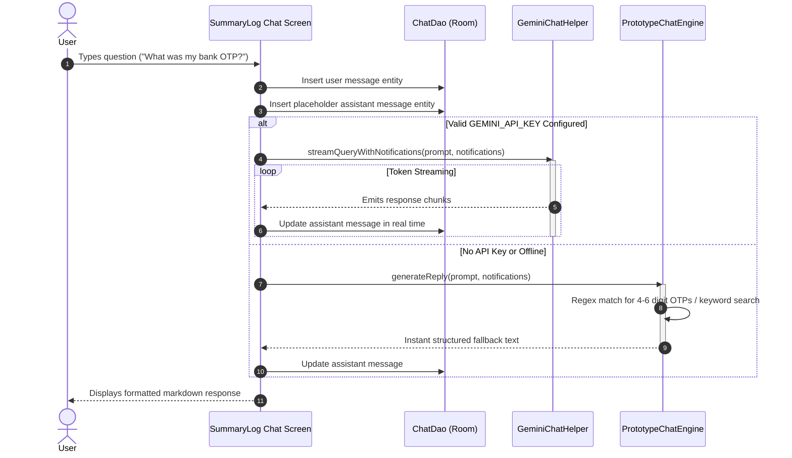

# SummaryLog 📱🤖

[](https://developer.android.com)
[](https://kotlinlang.org)
[](https://developer.android.com/jetpack/compose)
[](https://developer.android.com/training/data-storage/room)
[](https://ai.google.dev)
[](https://developer.android.com)

> **SummaryLog** is a private, offline-first Android notification manager, conversation thread organizer, and AI-powered notification assistant. It automatically archives incoming notifications, groups alerts into chat-like threads, enables natural-language queries via Google Gemini (with an offline regex fallback), and provides instant PDF exports—all while keeping your data strictly on your device.

---

## 📑 Table of Contents

- [Why SummaryLog?](#-why-summarylog)
  - [The Problem](#the-problem)
  - [The Solution](#the-solution)
  - [Target Audience](#target-audience)
- [Key Features](#-key-features)
- [System Architecture](#-system-architecture)
  - [High-Level Architecture Diagram](#high-level-architecture-diagram)
  - [Notification Capture Pipeline](#notification-capture-pipeline)
  - [AI & Fallback Query Flow](#ai--fallback-query-flow)
- [Getting Started & Installation](#-getting-started--installation)
  - [Prerequisites](#prerequisites)
  - [Step-by-Step Installation](#step-by-step-installation)
  - [Configuring the Gemini API Key](#configuring-the-gemini-api-key)
  - [Granting Notification Access](#granting-notification-access)
  - [Verifying Installation](#verifying-installation)
- [Real-World Usage Scenarios](#-real-world-usage-scenarios)
  - [1. Natural-Language Notification Queries](#1-natural-language-notification-queries)
  - [2. Instant OTP & Verification Code Retrieval](#2-instant-otp--verification-code-retrieval)
  - [3. Reviewing Threaded Conversations](#3-reviewing-threaded-conversations)
  - [4. Exporting Conversation Logs to PDF](#4-exporting-conversation-logs-to-pdf)
  - [5. Granular App Whitelisting](#5-granular-app-whitelisting)
  - [6. Automated Notification Retention](#6-automated-notification-retention)
- [Tech Stack & Architecture](#-tech-stack--architecture)
- [Database Schema](#-database-schema)
- [Privacy & Security Guarantee](#-privacy--security-guarantee)
- [Contributing](#-contributing)
- [Roadmap](#-roadmap)
- [License](#-license)

---

## 💡 Why SummaryLog?

### The Problem
Android notifications are transient by design. Millions of users experience:
- **Accidental Dismissals**: Swiping away a notification before reading it or losing an important message forever.
- **Lost Verification Codes & OTPs**: Banking, shopping, or two-factor authentication codes expiring while switching between apps.
- **Notification Flooding**: Getting overwhelmed by hundreds of alerts daily from messaging apps, ride-hailing services, delivery apps, and system monitors.
- **Fragmented History**: Having to open multiple separate applications just to find context about past communications.

### The Solution
**SummaryLog** solves these problems by providing:
1. **Continuous Local Archiving**: Every notification from selected apps is stored locally in an on-device SQLite database via Room.
2. **Context-Aware AI Assistant**: Ask natural-language questions such as *"Did John message me about the meeting time?"* or *"Summarize my alerts from the last 2 hours"* and receive streaming Markdown answers.
3. **Zero-Latency Offline Fallback**: Even without an internet connection or API key, an offline pattern-matching engine instantly detects OTPs and searches notification text.
4. **Clean Conversation Grouping**: Automatically clusters notifications into WhatsApp/Messenger-style threads sorted by recency and unread status.

### Target Audience
- **Everyday Android Users**: Anyone who frequently misses alerts or needs a reliable notification history.
- **Power Users & Professionals**: Users managing heavy volumes of Slack, Teams, WhatsApp, and email communications across their workday.
- **Privacy-Conscious Individuals**: Users who want complete notification logs without trusting their data to cloud servers or third-party trackers.
- **Android Developers & Enthusiasts**: Developers looking for modern Jetpack Compose, Room KSP, and Google Generative AI reference architectures.

---

## ✨ Key Features

| Category | Feature | Status | Description |
|---|---|---|---|
| **Capture** | **Background Ingestion** | ✅ Implemented | Intercepts title, text, app package, and timestamp via `NotificationListenerService`. |
| **Capture** | **Media/Image Extraction** | ✅ Implemented | Saves rich notification pictures and large icons directly to internal private storage. |
| **Intelligence** | **Gemini AI Streaming** | ✅ Implemented | Streams contextual answers using `gemini-2.5-flash` with rich markdown and syntax highlighting. |
| **Intelligence** | **Offline Regex Engine** | ✅ Implemented | Extracts 4–6 digit OTPs, codes, and keyword summaries with zero internet dependency. |
| **Organization** | **Chat-Style Threads** | ✅ Implemented | Groups alerts into clean conversation threads by app package and contact/title. |
| **Organization** | **Conversation Pinning** | ✅ Implemented | Pins critical conversation threads to the top of your feed for fast access. |
| **Export** | **PDF Export** | ✅ Implemented | Generates clean, paginated PDF transcripts of any conversation thread directly to storage. |
| **Control** | **App Whitelist Filter** | ✅ Implemented | Toggle monitoring per installed app with batch Select All and Deselect All switches. |
| **Analytics** | **Insights & Activity** | ✅ Implemented | Displays today's alert volume, all-time counts, and top 5 most active applications. |
| **Maintenance** | **Auto-Prune Worker** | ✅ Implemented | Scheduled background `WorkManager` prunes notifications older than 30, 60, or 90 days. |
| **UI/UX** | **Adaptive Split Screen** | ✅ Implemented | Draggable split-screen layout with an interactive drag handle to adjust list and chat heights. |
| **UI/UX** | **AMOLED Dark Theme** | ✅ Implemented | Optimized high-contrast dark theme with Material 3 dynamic color tokens. |

---

## 🏗️ System Architecture

SummaryLog follows modern Android architecture patterns with a **local-first, reactive pipeline**.

### High-Level Architecture Diagram



### Notification Capture Pipeline



### AI & Fallback Query Flow



---

## 🚀 Getting Started & Installation

### Prerequisites
Before building and running SummaryLog, ensure you have:
- **Android Studio**: Ladybug (2024.2.1+) or newer.
- **Java Development Kit (JDK)**: JDK 17 (recommended) or JDK 11+.
- **Android SDK**: Compile SDK `37`, Target SDK `37`, Minimum SDK `24` (Android 7.0 Nougat or higher).
- **Physical Device or Android Virtual Device (AVD)**: Running Android 7.0+.
- **(Optional) Google Gemini API Key**: Free tier available from [Google AI Studio](https://aistudio.google.com/).

### Step-by-Step Installation

1. **Clone the Repository**:
   ```bash
   git clone https://github.com/your-username/SummaryLog.git
   cd SummaryLog
   ```

2. **Configure Local Environment & Gemini Key**:
   Create or edit the `local.properties` file in the root directory:
   ```properties
   ## Standard Android SDK Path
   sdk.dir=/path/to/your/Android/Sdk

   ## Google Gemini API Key (Optional but recommended)
   GEMINI_API_KEY=your_actual_gemini_api_key_here
   ```
   > [!TIP]
   > If you do not provide a `GEMINI_API_KEY`, SummaryLog automatically activates its built-in offline engine (`PrototypeChatEngine`). The app remains 100% functional for searching, thread reading, and OTP extraction!

3. **Build the Debug APK**:
   ```bash
   ./gradlew assembleDebug
   ```

4. **Install onto your Connected Device**:
   ```bash
   ./gradlew installDebug
   ```
   *Or open the project in Android Studio and press **Shift + F10** (Run 'app').*

---

### Granting Notification Access

Because Android sandboxes notification data for privacy, SummaryLog requires the system-level **Notification Listener** permission:

1. Launch **SummaryLog** on your device.
2. If access is not yet granted, a prompt button will appear: **"Grant Notification Access"**.
3. Tap the button to navigate to **Android Settings > Notification Access**.
4. Locate **SummaryLog** in the list and toggle the switch **ON**.
5. Confirm the system warning dialog by selecting **Allow**.

> [!NOTE]
> You can revoke or re-enable this permission at any time in your device's **Settings > Apps > Special App Access > Notification Access**.

---

### Verifying Installation

To confirm everything is functioning correctly:
1. Ensure SummaryLog is running in the background.
2. Send yourself a test notification (e.g., send a message via WhatsApp, an SMS, or an email).
3. Open SummaryLog and switch to the **Home** tab: the new notification will appear immediately in the **Live Notifications** feed.
4. In the chat window at the bottom, type:
   ```text
   Summarize my recent notifications
   ```
5. You should see a formatted response listing your test alert.

---

## 🔍 Real-World Usage Scenarios

### 1. Natural-Language Notification Queries
Ask questions in plain conversational English without worrying about exact search syntax:

```text
User: "What updates did I get from GitHub or Jira this morning?"
```
```markdown
**SummaryLog Assistant**:
Here are your recent development updates:
- **GITHUB**: Pull request #42 *"Implement Room database migration"* was merged by @tejas.
- **JIRA**: Issue `SUM-108` was assigned to you with priority **High**.
```

### 2. Instant OTP & Verification Code Retrieval
Never lose a 2FA code while juggling multiple apps:

```text
User: "Show me my latest OTP"
```
```markdown
**SummaryLog Assistant**:
Found verification codes:
• **Chase Bank**: Your one-time passcode is `749102`. Valid for 10 minutes.
• **Google**: Your verification code is `391048`.
```

### 3. Reviewing Threaded Conversations
Navigate to the **Chats** tab (`ConversationFeedScreen`) to view all notifications grouped automatically by contact and application.
- Tap any conversation to view chronological message history.
- Long-press any conversation to enter selection mode and batch-delete entries.
- Tap **Mark All Read** in the top bar to reset unread counters.

### 4. Exporting Conversation Logs to PDF
Need a record of client messages, delivery confirmation logs, or order updates?
1. Open any thread in the **Chats** tab.
2. Tap the **PDF icon** in the top action bar.
3. Choose a destination file name using the native Android Storage Access Framework (SAF).
4. A cleanly formatted, paginated PDF document with timestamps, sender details, and message text is saved to your device.

### 5. Granular App Whitelisting
Avoid clutter from spammy games or background sync alerts:
1. Navigate to the **Track Apps** tab (`AppWhitelistScreen`).
2. Search installed applications using the search bar.
3. Toggle individual switches ON for apps you want to record (e.g., Slack, WhatsApp, Gmail).
4. Use **Select All** or **Deselect All** for quick batch configuration.

### 6. Automated Notification Retention
Prevent database bloat and conserve internal storage:
1. On the **Home** screen, tap the **Timer icon** next to the notification counter.
2. Select your preferred retention window:
   - **30 Days** (Default)
   - **60 Days**
   - **90 Days**
   - **Never** (Keep all notifications indefinitely)
3. The background `NotificationPruneWorker` will run silently once every 24 hours to delete expired records.

---

## 🛠️ Tech Stack & Architecture

| Layer | Component | Version / Description |
|---|---|---|
| **Language** | [Kotlin](https://kotlinlang.org/) | `2.0+` with modern coroutines and Flow |
| **UI Framework** | [Jetpack Compose](https://developer.android.com/jetpack/compose) | Declarative UI, Material 3 design system, Edge-to-Edge |
| **Architecture** | Reactive MVVM / MVI | Coroutine Flow, Room reactive streams, State-driven UI |
| **Local Database** | [Room](https://developer.android.com/training/data-storage/room) | `2.6.1` with KSP compiler, SQLite local persistence |
| **AI Integration** | [Google Generative AI](https://ai.google.dev/) | `0.9.0` Client SDK (`gemini-2.5-flash`), token streaming |
| **Offline Search** | Pattern Engine | Local regex parser for OTPs, dates, and keyword filtering |
| **Background Work** | [WorkManager](https://developer.android.com/topic/libraries/architecture/workmanager) | `2.9.1` Periodic daily worker for database maintenance |
| **Document Export** | Android `PdfDocument` | Native canvas-based multi-page PDF generation |
| **Image Loading** | Accompanist | `0.37.3` DrawablePainter for installed app icon rendering |

---

## 🗄️ Database Schema

SummaryLog uses **Room** (`summarylog_db`, version 5) with full SQLite indexing on high-frequency query columns.

### `notifications` Table
Stores all intercepted status bar notifications.

| Column | Type | Constraints | Description |
|---|---|---|---|
| `id` | `INTEGER` | `PRIMARY KEY AUTOINCREMENT` | Unique identifier for each alert |
| `packageName` | `TEXT` | `NOT NULL`, Indexed | Package name of the source app (e.g. `com.whatsapp`) |
| `appName` | `TEXT` | `NOT NULL` | Human-readable app name (e.g. `WhatsApp`) |
| `title` | `TEXT` | `NOT NULL`, Indexed | Sender name or notification subject |
| `text` | `TEXT` | `NOT NULL` | Body content of the notification |
| `imagePath` | `TEXT` | `NULLABLE` | Local filesystem path to extracted notification image |
| `isRead` | `INTEGER` | `NOT NULL`, Indexed | Read state boolean (`0` = unread, `1` = read) |
| `timestamp` | `INTEGER` | `NOT NULL`, Indexed | Arrival epoch timestamp in milliseconds |

### `monitored_apps` Table
Controls which installed applications are logged.

| Column | Type | Constraints | Description |
|---|---|---|---|
| `packageName` | `TEXT` | `PRIMARY KEY` | Package identifier of the monitored application |
| `appName` | `TEXT` | `NOT NULL` | Display name of the application |
| `isMonitored` | `INTEGER` | `NOT NULL` | Boolean flag indicating whether logging is active |

### `chat_messages` Table
Maintains persistent conversational history with the AI assistant.

| Column | Type | Constraints | Description |
|---|---|---|---|
| `id` | `TEXT` | `PRIMARY KEY` | UUID string identifying each message |
| `text` | `TEXT` | `NOT NULL` | Content of the user query or AI response |
| `isUser` | `INTEGER` | `NOT NULL` | Boolean flag (`1` = user, `0` = assistant) |
| `timestamp` | `INTEGER` | `NOT NULL` | Message generation timestamp |

### `conversation_meta` Table
Stores custom metadata for conversation threads.

| Column | Type | Constraints | Description |
|---|---|---|---|
| `id` | `TEXT` | `PRIMARY KEY` | Composite key: `packageName_title` |
| `isPinned` | `INTEGER` | `NOT NULL` | Boolean flag indicating whether thread is pinned to top |

---

## 🛡️ Privacy & Security Guarantee

Your privacy is paramount. SummaryLog was designed from the ground up to protect personal communications:

- 🔒 **100% Local Storage**: All notifications, images, and chat logs are stored directly on your device in your app's sandboxed private storage (`/data/data/com.ts.summarylog/`).
- 🚫 **Zero Third-Party Telemetry**: SummaryLog contains no advertising SDKs, no Google Analytics, no Firebase Crashlytics, and no background network trackers.
- 🌐 **Controlled AI Transmission**: 
  - SummaryLog will **never** transmit data in the background.
  - When you explicitly send a question to the AI assistant, only the **last 50 notification snippets** are sent in context to Google Gemini to formulate the answer.
  - If you prefer total air-gapped privacy, leave the `GEMINI_API_KEY` blank. The offline engine performs all searches locally on your device's CPU.
- 🗑️ **Permanent Deletion**: Deleting notifications or triggering auto-retention physically removes rows from SQLite and deletes cached image files.

---

## 🤝 Contributing

Contributions from the open-source community are warmly welcomed!

### How to Contribute
1. **Fork the Repository** on GitHub.
2. **Create a Feature Branch**:
   ```bash
   git checkout -b feature/awesome-new-capability
   ```
3. **Commit your Changes**:
   Follow conventional commit messages:
   ```bash
   git commit -m "feat(insights): add weekly notification volume bar chart"
   ```
4. **Push to your Branch**:
   ```bash
   git push origin feature/awesome-new-capability
   ```
5. **Open a Pull Request**: Provide a clear description of the problem solved and include screenshots of any UI modifications.

### Code Style Guidelines
- Follow official [Kotlin Coding Conventions](https://kotlinlang.org/docs/coding-conventions.html) and [Android Jetpack Compose guidelines](https://developer.android.com/jetpack/compose/architecture).
- Maintain documentation integrity and preserve inline comments.
- Run code formatting before committing:
  ```bash
  ./gradlew check
  ```

---

## 🗺️ Roadmap

- [ ] **Custom Notification Rules**: Auto-dismiss, trigger alarms, or generate custom vibrations based on regex triggers.
- [ ] **On-Device Embeddings & Vector Search**: Local semantic search across thousands of notifications without cloud APIs.
- [ ] **Biometric App Lock**: Fingerprint and Face Unlock authentication to secure access to the notification archive.
- [ ] **Interactive Notification Actions**: Trigger reply or mark-as-read actions directly from the SummaryLog conversation view.
- [ ] **Backup & Restore**: Encrypted local database export and import.

---

## 📄 License

This project is licensed under the **Apache License, Version 2.0**. See the [LICENSE](LICENSE) file for details.

```text
Copyright 2026 SummaryLog Contributors

Licensed under the Apache License, Version 2.0 (the "License");
you may not use this file except in compliance with the License.
You may obtain a copy of the License at

    http://www.apache.org/licenses/LICENSE-2.0
```

---

*Crafted with ❤️ for Android power users and the open-source community.*